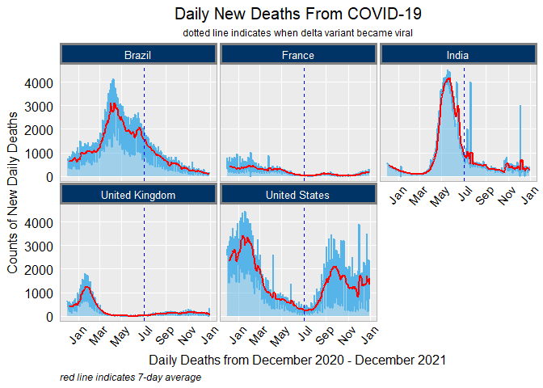
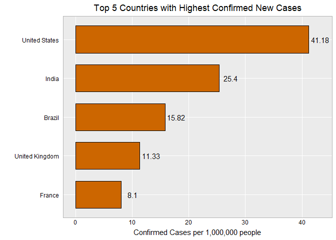

COVID Graph Redesign
================
Hannah Abraham
5/27/2022

``` r
library(ggplot2)
library(tidyverse)
```

    ## Warning: package 'tidyverse' was built under R version 4.1.2

    ## -- Attaching packages --------------------------------------- tidyverse 1.3.1 --

    ## v tibble  3.1.4     v dplyr   1.0.7
    ## v tidyr   1.1.3     v stringr 1.4.0
    ## v readr   2.0.1     v forcats 0.5.1
    ## v purrr   0.3.4

    ## -- Conflicts ------------------------------------------ tidyverse_conflicts() --
    ## x dplyr::filter() masks stats::filter()
    ## x dplyr::lag()    masks stats::lag()

``` r
library(dplyr)
library(anytime)
```

    ## Warning: package 'anytime' was built under R version 4.1.2

``` r
library(tidyquant)
```

    ## Warning: package 'tidyquant' was built under R version 4.1.2

    ## Loading required package: lubridate

    ## 
    ## Attaching package: 'lubridate'

    ## The following objects are masked from 'package:base':
    ## 
    ##     date, intersect, setdiff, union

    ## Loading required package: PerformanceAnalytics

    ## Warning: package 'PerformanceAnalytics' was built under R version 4.1.2

    ## Loading required package: xts

    ## Warning: package 'xts' was built under R version 4.1.2

    ## Loading required package: zoo

    ## Warning: package 'zoo' was built under R version 4.1.2

    ## 
    ## Attaching package: 'zoo'

    ## The following objects are masked from 'package:base':
    ## 
    ##     as.Date, as.Date.numeric

    ## 
    ## Attaching package: 'xts'

    ## The following objects are masked from 'package:dplyr':
    ## 
    ##     first, last

    ## 
    ## Attaching package: 'PerformanceAnalytics'

    ## The following object is masked from 'package:graphics':
    ## 
    ##     legend

    ## Loading required package: quantmod

    ## Warning: package 'quantmod' was built under R version 4.1.2

    ## Loading required package: TTR

    ## Warning: package 'TTR' was built under R version 4.1.2

    ## Registered S3 method overwritten by 'quantmod':
    ##   method            from
    ##   as.zoo.data.frame zoo

    ## == Need to Learn tidyquant? ====================================================
    ## Business Science offers a 1-hour course - Learning Lab #9: Performance Analysis & Portfolio Optimization with tidyquant!
    ## </> Learn more at: https://university.business-science.io/p/learning-labs-pro </>

``` r
library(plotly)
```

    ## Warning: package 'plotly' was built under R version 4.1.2

    ## 
    ## Attaching package: 'plotly'

    ## The following object is masked from 'package:ggplot2':
    ## 
    ##     last_plot

    ## The following object is masked from 'package:stats':
    ## 
    ##     filter

    ## The following object is masked from 'package:graphics':
    ## 
    ##     layout

## Data cleaning and transformation

``` r
covid <- read.csv("covid.csv")

# updating date to date format 
covid %>%
  mutate(date = anydate(date)) ->
  covid

covid <- covid %>% 
   filter(location %in% c("United States", "India", "Brazil", "France", "United Kingdom"))

# filtering for dates between December 2020 to December 2021 
covid %>%
 filter(date >= as.Date("2020-12-01") & date <= as.Date("2021-12-31")) -> covid

# filtered and cleaned dataframe as tibble 
covid <- as_tibble(covid)
```

## Time series plot for daily death rates per million

``` r
daily_deaths <- covid %>% 
  ggplot(aes(x=date, y=new_deaths)) +
  geom_line(aes(group=location), size = 1, color = "#56B4E9") +
  geom_area(fill ="#56B4E9", alpha = 0.5) +
  geom_ma(ma_fun = SMA, n = 7, color = "red", linetype="solid", size = 0.9) +   geom_vline(aes(xintercept=as.Date("2021-07-01")),
            color="blue", linetype="dashed", size=0.5) +
  scale_x_date(date_breaks = "2 month", date_labels = "%b") + 
  labs(title = "Daily New Deaths From COVID-19", subtitle = "dotted line indicates when delta variant became viral", caption = "red line indicates 7-day average", x = "Daily Deaths from December 2020 - December 2021", y = "Counts of New Daily Deaths") + hw +
  theme(axis.text.x=element_text(angle=50, hjust=1, size = 11), axis.text.y=element_text(size = 12), axis.title = element_text(size = 12), plot.title = element_text(size = 15), plot.subtitle = element_text(size = 9), plot.caption = element_text(hjust = 0, face = "italic", size = 9)) + 
  facet_wrap(location~.) +
  expand_limits(y = 0) +
  theme(strip.text.y = element_text(angle = 0)) + theme(legend.position ="none") + theme(strip.background = element_rect(fill= "#003366", size=2), strip.text = element_text(color = 'white', size=10))
                      

daily_deaths
```

    ## Warning: Removed 1 rows containing missing values (position_stack).

<!-- -->

## Bar graph for top 10 countries with the highest confirmed covid cases between December 2020 to December 2021

``` r
covid %>% 
  select(location, new_cases) %>% 
  group_by(location) %>% 
  summarise(new_cases = sum(new_cases, na.rm = TRUE)) %>% 
  arrange(-new_cases) %>% 
  top_n(5) %>%   
  ggplot(aes(y = fct_reorder(location, new_cases/1000000), x = new_cases/1000000)) +
    geom_bar(stat = 'identity', fill = '#CC6600', width = 0.7, color = "black") +
  geom_text(aes(label=round(new_cases/1000000,2)), nudge_x = 2) +
    labs(title = "Top 5 Countries with Highest Confirmed New Cases", x = "Confirmed Cases per 1,000,000 people", y = '') + 
  hw
```

    ## Selecting by new_cases

<!-- -->

\`\`\`
